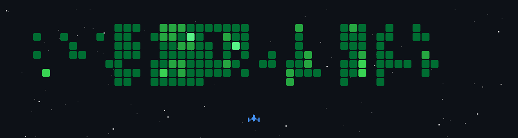

## 🚀Aleron Maulana-GitHub Activity Game

## 👋Hi, I'm Aleron Maulana

<b>MOBILE DEVELOPMENT</b> &nbsp;|&nbsp; <b>UI/UX DESIGN</b> &nbsp;|&nbsp; <b>WEB DEVELOPMENT</b>

I am a 5th-semester Informatics Engineering student at Universitas Airlangga. I bridge the gap between visually stunning design and robust mobile/web development.

####

- 🚀 **Currently Interning:** Mobile Developer & UI/UX Designer at **PT Multi Fabrindo Gemilang**.
- 📱 **Featured Project:** Developed **"Smile Multifab"** (Mobile App) from user persona research to coding with Flutter.
- 🌱 **Learning:** Deep diving into **Laravel** and **Docker Multi-Container** architecture.

### 📫 Connect with Me
- 🌐 Portfolio: [portofolio-aleron-maulana.vercel.app](https://portofolio-aleron-maulana.vercel.app/)
- 💼 LinkedIn: [Aleron Maulana Firjatullah](https://www.linkedin.com/in/aleron-maulana-firjatullah-037200374)
- 📸 Instagram: [@aleronmaulanaaa](https://www.instagram.com/aleronmaulanaaa)
- 📧 Email: aleronmaulanaf@gmail.com

## 🛠 Tech Stack & GitHub Analytics

  
  

###

  

  
  

 
  
  
  
  

###

---

  

